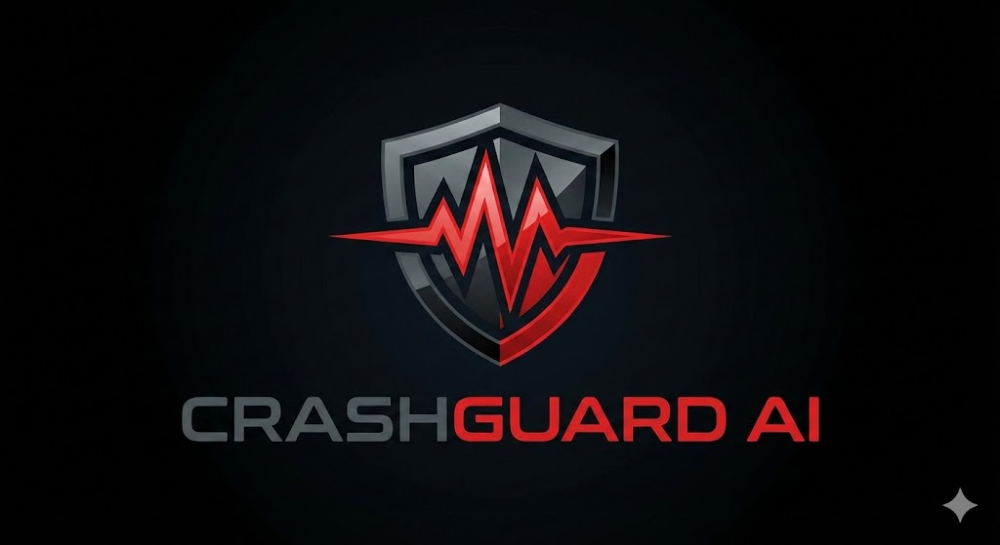

# 🚨 CrashGuard AI - Intelligent Accident Detection System

<div align="center">
  
  
  <p><strong>AI-Powered Real-Time Accident Detection and Emergency Response System</strong></p>
  
  [](https://nextjs.org/)
  [](https://flask.palletsprojects.com/)
  [](https://github.com/ultralytics/ultralytics)
  [](https://www.python.org/)
  [](https://www.typescriptlang.org/)
</div>

---

## 📋 Table of Contents

- [Overview](#-overview)
- [Features](#-features)
- [Tech Stack](#-tech-stack)
- [System Architecture](#-system-architecture)
- [Installation](#-installation)
- [Usage](#-usage)
- [Project Structure](#-project-structure)
- [API Documentation](#-api-documentation)
- [Screenshots](#-screenshots)
- [Contributing](#-contributing)
- [License](#-license)

---

## 🎯 Overview

**CrashGuard AI** is an advanced accident detection system that leverages deep learning and computer vision to monitor CCTV feeds in real-time, automatically detect vehicle collisions, and instantly alert emergency services. The system uses YOLOv8 for object detection and provides a modern, user-friendly interface for monitoring and analysis.

### Key Capabilities

- 🎥 **Real-Time Video Analysis**: Process CCTV feeds frame-by-frame using CNN-based deep learning
- 🚗 **Multi-Object Detection**: Identify 80+ object classes including vehicles, pedestrians, and obstacles
- 🚨 **Instant Alerts**: Automatic emergency notifications with location data and incident screenshots
- 📊 **Analytics Dashboard**: Comprehensive monitoring and historical data analysis
- 🌐 **No Authentication Required**: Direct access for emergency response teams
- 📱 **Responsive Design**: Works seamlessly across desktop and mobile devices

---

## ✨ Features

### Core Functionality

#### 1. **AI-Powered Detection**
- YOLOv8 neural network for accurate object detection
- Frame-by-frame video analysis with confidence scoring
- Real-time accident pattern recognition
- Support for multiple video formats (MP4, MOV, AVI)

#### 2. **Emergency Response System**
- Automatic alert generation on accident detection
- Location tracking with GPS coordinates
- Email notifications to authorities
- Incident severity assessment
- Screenshot capture at moment of detection

#### 3. **User Interface**
- Modern dark theme design
- Drag-and-drop video upload
- Live detection stream visualization
- Interactive accident alerts
- Comprehensive information panels

#### 4. **Dashboard & Analytics**
- Monthly accident statistics
- Historical data visualization
- Detailed incident reports
- Location-based mapping
- Exportable data

---

## 🛠 Tech Stack

### Frontend
- **Framework**: Next.js 14 (React 18)
- **Language**: TypeScript
- **Styling**: Tailwind CSS
- **UI Components**: Shadcn/ui, Radix UI
- **State Management**: React Query (TanStack Query)
- **Forms**: React Hook Form + Zod validation
- **Maps**: Leaflet
- **Charts**: Recharts

### Backend
- **Framework**: Flask 3.0
- **Language**: Python 3.12
- **Database**: MongoDB
- **ML Framework**: Ultralytics YOLOv8
- **Computer Vision**: OpenCV, CVZone
- **Image Processing**: Pillow
- **Cloud Storage**: Cloudinary
- **Email**: Flask-Mail, Nodemailer

### AI/ML
- **Model**: YOLOv8 (yolov8n.pt, yolov8s.pt)
- **Training**: Roboflow
- **Detection**: 80+ object classes
- **Processing**: CPU-based inference
- **Tracking**: SORT algorithm

---

## 🏗 System Architecture

```
┌─────────────────────────────────────────────────────────────┐
│                        Client Layer                          │
│  ┌──────────────┐  ┌──────────────┐  ┌──────────────┐      │
│  │   Next.js    │  │  Dashboard   │  │  Analytics   │      │
│  │   Frontend   │  │     UI       │  │    Charts    │      │
│  └──────────────┘  └──────────────┘  └──────────────┘      │
└─────────────────────────────────────────────────────────────┘
                            ↕ HTTP/REST API
┌─────────────────────────────────────────────────────────────┐
│                      Application Layer                       │
│  ┌──────────────┐  ┌──────────────┐  ┌──────────────┐      │
│  │    Flask     │  │   Video      │  │   Alert      │      │
│  │    Server    │  │  Processing  │  │   System     │      │
│  └──────────────┘  └──────────────┘  └──────────────┘      │
└─────────────────────────────────────────────────────────────┘
                            ↕
┌─────────────────────────────────────────────────────────────┐
│                         AI Layer                             │
│  ┌──────────────┐  ┌──────────────┐  ┌──────────────┐      │
│  │   YOLOv8     │  │   Object     │  │   Pattern    │      │
│  │    Model     │  │  Detection   │  │  Recognition │      │
│  └──────────────┘  └──────────────┘  └──────────────┘      │
└─────────────────────────────────────────────────────────────┘
                            ↕
┌─────────────────────────────────────────────────────────────┐
│                        Data Layer                            │
│  ┌──────────────┐  ┌──────────────┐  ┌──────────────┐      │
│  │   MongoDB    │  │  Cloudinary  │  │    Email     │      │
│  │   Database   │  │   Storage    │  │   Service    │      │
│  └──────────────┘  └──────────────┘  └──────────────┘      │
└─────────────────────────────────────────────────────────────┘
```

---

## 📦 Installation

### Prerequisites

- **Node.js** 18+ and npm
- **Python** 3.12+
- **MongoDB** (local or cloud)
- **Git**

### Step 1: Clone the Repository

```bash
git clone https://github.com/yourusername/crashguard-ai.git
cd crashguard-ai
```

### Step 2: Backend Setup (Flask Server)

```bash
# Navigate to server directory
cd server

# Create virtual environment
python -m venv venv

# Activate virtual environment
# Windows:
.\venv\Scripts\activate
# macOS/Linux:
source venv/bin/activate

# Install dependencies
pip install -r requirements.txt

# Create .env file
cp .env.example .env
# Edit .env with your configuration

# Run the server
python app.py
```

The backend will start on `http://127.0.0.1:8080`

### Step 3: Model Implementor Setup

```bash
# Navigate to model-implementor directory
cd model-implementor

# Create virtual environment
python -m venv venv

# Activate virtual environment
.\venv\Scripts\activate  # Windows
source venv/bin/activate  # macOS/Linux

# Install dependencies
pip install -r requirements.txt

# Run the service
python app.py
```

### Step 4: Frontend Setup (Next.js)

```bash
# Navigate to client directory
cd client

# Install dependencies
npm install

# Create .env file
cp .env.example .env
# Edit .env with your configuration

# Run development server
npm run dev
```

The frontend will start on `http://localhost:3000`

---

## 🚀 Usage

### 1. Access the Application

Open your browser and navigate to `http://localhost:3000`

### 2. Upload a Video

- Click on the upload area or drag and drop a video file
- Supported formats: MP4, MOV, AVI
- Maximum file size: 100MB

### 3. View Detection Results

- Watch the live detection stream
- See bounding boxes around detected objects
- Confidence scores displayed for each detection
- Accident alerts appear automatically when detected

### 4. Monitor Dashboard

- Navigate to `/dashboard` for analytics
- View monthly accident statistics
- Access detailed incident reports
- Export data for further analysis

### Test Videos

Sample videos are available in:
- `server/static/videos/bikes.mp4`
- `server/static/videos/car-crash.mov`
- `model-implementor/assets/car-crash.mov`

---

## 📁 Project Structure

```
crashguard-ai/
├── client/                      # Next.js Frontend
│   ├── app/                     # App router pages
│   │   ├── (auth)/             # Authentication pages
│   │   ├── (dashboard)/        # Dashboard pages
│   │   └── (mainboard)/        # Main landing pages
│   ├── components/             # React components
│   │   ├── auth/               # Auth components
│   │   ├── dashboard/          # Dashboard components
│   │   ├── mainboard/          # Landing page components
│   │   └── ui/                 # UI primitives
│   ├── public/                 # Static assets
│   └── package.json
│
├── server/                      # Flask Backend
│   ├── blueprints/             # API routes
│   │   ├── auth/               # Authentication
│   │   ├── accident/           # Accident endpoints
│   │   └── public/             # Public endpoints
│   ├── models/                 # YOLO models
│   │   ├── yolov8n.pt         # Nano model
│   │   └── i1-yolov8s.pt      # Small model
│   ├── modules/                # Utility modules
│   ├── static/                 # Static files
│   │   ├── images/            # Uploaded images
│   │   └── videos/            # Uploaded videos
│   ├── app.py                  # Main application
│   └── requirements.txt
│
├── model-implementor/          # ML Service
│   ├── assets/                # Test assets
│   ├── models/                # ML models
│   ├── modules/               # Processing modules
│   ├── services/              # External services
│   ├── app.py                 # Main service
│   └── requirements.txt
│
├── logo.jpg                    # Project logo
└── README.md                   # This file
```

---

## 🔌 API Documentation

### Base URL
```
http://127.0.0.1:8080/api/v1
```

### Endpoints

#### Upload Video
```http
POST /public/upload-video
Content-Type: multipart/form-data

Body:
  image: <video_file>

Response:
{
  "status": "success",
  "path": "filename_timestamp.mp4"
}
```

#### Get Detection Stream
```http
GET /public/show-video/static/videos/<filename>

Response: MJPEG stream
Content-Type: multipart/x-mixed-replace; boundary=frame
```

#### Get All Accidents
```http
GET /accident/all

Response:
{
  "datas": [
    {
      "id": "...",
      "address": "...",
      "latitude": 0.0,
      "longitude": 0.0,
      "severity": "Moderate",
      "timestamp": "..."
    }
  ]
}
```

---

## 🔧 Configuration

### Environment Variables

#### Client (.env)
```env
NEXT_PUBLIC_API_URL=http://127.0.0.1:8080
```

#### Server (.env)
```env
MONGODB_URI=mongodb://localhost:27017/accident_detection
CLOUDINARY_CLOUD_NAME=your_cloud_name
CLOUDINARY_API_KEY=your_api_key
CLOUDINARY_API_SECRET=your_api_secret
MAIL_SERVER=smtp.gmail.com
MAIL_PORT=587
MAIL_USERNAME=your_email@gmail.com
MAIL_PASSWORD=your_app_password
```

---

## 🤝 Contributing

Contributions are welcome! Please follow these steps:

1. Fork the repository
2. Create a feature branch (`git checkout -b feature/new`)
3. Commit your changes (`git commit -m 'new'`)
4. Push to the branch (`git push origin new`)
5. Open a Pull Request

### Development Guidelines

- Follow the existing code style
- Write meaningful commit messages
- Add tests for new features
- Update documentation as needed
- Ensure all tests pass before submitting PR

---

## 📝 License

This project is licensed under the MIT License - see the [LICENSE](LICENSE) file for details.
## 🙏 Acknowledgments

- [Ultralytics YOLOv8](https://github.com/ultralytics/ultralytics) - Object detection model
- [Roboflow](https://roboflow.com/) - Dataset preparation and training
- [Next.js](https://nextjs.org/) - React framework
- [Flask](https://flask.palletsprojects.com/) - Python web framework
- [Tailwind CSS](https://tailwindcss.com/) - Styling framework

---

## 📞 Support

For support, email kunalchandra2506@gmail.com or open an issue in the repository.

---

## 🔮 Future Enhancements

- [ ] GPU acceleration for faster processing
- [ ] Multi-camera support
- [ ] Mobile application
- [ ] Advanced analytics with ML insights
- [ ] Integration with traffic management systems
- [ ] Real-time notification via SMS/Push
- [ ] Multi-language support
- [ ] Cloud deployment options

---

<div align="center">
  <p>Made with ❤️ for safer roads</p>
  <p>© 2024 CrashGuard AI. All rights reserved.</p>
</div>
